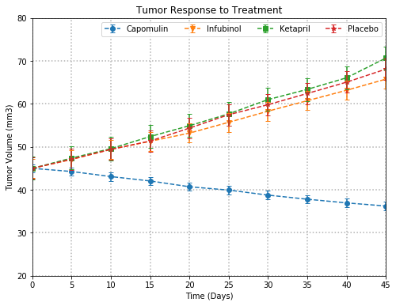
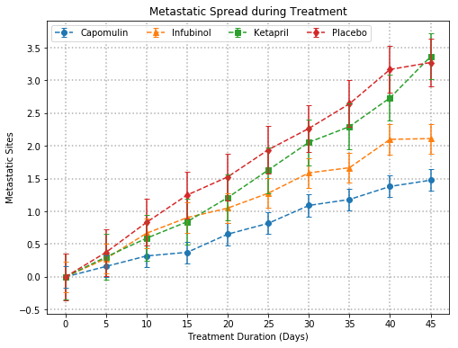
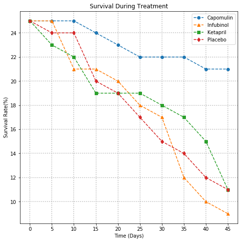
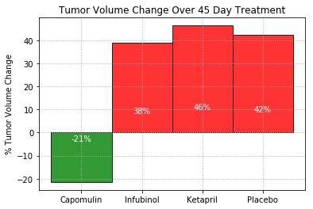

Analysis:
1. The Tumor Volume for the treatment using drug "Capomulin" has subsequently decreased to a certain extent over the period of 45 days while it has increase in all other treatments
2. The Survival rate of the mice for the treatment using the drug "Capomulin" is much better than the other treatment methods
3. The Metastatic Spread during Treatment using the drug "Capomulin" is also less when compared to others
4. Overall treatment using drug "Capomulin" had shown better results when compared to the other treatment methods by reducing the tumor volume by 21%


```python
# Dependencies
import csv
import pandas as pd
import random
import os
import numpy as np
import matplotlib.pyplot as plt

```


```python
# Load and Visualize the data
file_path = os.path.join("generated_data", "clinicaltrial_data.csv")
clinicaltrial_df = pd.read_csv(file_path)
clinicaltrial_df.head()
```


<div>
<style>
    .dataframe thead tr:only-child th {
        text-align: right;
    }

    .dataframe thead th {
        text-align: left;
    }

    .dataframe tbody tr th {
        vertical-align: top;
    }
</style>
<table border="1" class="dataframe">
  <thead>
    <tr style="text-align: right;">
      <th></th>
      <th>Mouse ID</th>
      <th>Timepoint</th>
      <th>Tumor Volume (mm3)</th>
      <th>Metastatic Sites</th>
    </tr>
  </thead>
  <tbody>
    <tr>
      <th>0</th>
      <td>b128</td>
      <td>0</td>
      <td>45.0</td>
      <td>0</td>
    </tr>
    <tr>
      <th>1</th>
      <td>f932</td>
      <td>0</td>
      <td>45.0</td>
      <td>0</td>
    </tr>
    <tr>
      <th>2</th>
      <td>g107</td>
      <td>0</td>
      <td>45.0</td>
      <td>0</td>
    </tr>
    <tr>
      <th>3</th>
      <td>a457</td>
      <td>0</td>
      <td>45.0</td>
      <td>0</td>
    </tr>
    <tr>
      <th>4</th>
      <td>c819</td>
      <td>0</td>
      <td>45.0</td>
      <td>0</td>
    </tr>
  </tbody>
</table>
</div>


```python
# Load and Visualize the data
file_path2 = os.path.join("generated_data", "mouse_drug_data.csv")
mouse_drug_df = pd.read_csv(file_path2)
mouse_drug_df.head()
```


<div>
<style>
    .dataframe thead tr:only-child th {
        text-align: right;
    }

    .dataframe thead th {
        text-align: left;
    }

    .dataframe tbody tr th {
        vertical-align: top;
    }
</style>
<table border="1" class="dataframe">
  <thead>
    <tr style="text-align: right;">
      <th></th>
      <th>Mouse ID</th>
      <th>Drug</th>
    </tr>
  </thead>
  <tbody>
    <tr>
      <th>0</th>
      <td>f234</td>
      <td>Stelasyn</td>
    </tr>
    <tr>
      <th>1</th>
      <td>x402</td>
      <td>Stelasyn</td>
    </tr>
    <tr>
      <th>2</th>
      <td>a492</td>
      <td>Stelasyn</td>
    </tr>
    <tr>
      <th>3</th>
      <td>w540</td>
      <td>Stelasyn</td>
    </tr>
    <tr>
      <th>4</th>
      <td>v764</td>
      <td>Stelasyn</td>
    </tr>
  </tbody>
</table>
</div>


```python
# Merge the data
pharmaceuticals_data = mouse_drug_df.merge(clinicaltrial_df)
# save the drugnames and timepoints
drug_names = pharmaceuticals_data['Drug'].unique()
timepoints = pharmaceuticals_data['Timepoint'].unique()

```


```python
# Calculate Tumor response to treatment
drug_time_group = pharmaceuticals_data.groupby(['Drug', 'Timepoint'])
drug_time = pd.DataFrame(drug_time_group['Tumor Volume (mm3)'].mean())

drug_time_df = drug_time.reset_index()
drug_time_df = drug_time_df.pivot(index='Timepoint', columns='Drug', values='Tumor Volume (mm3)')
drug_time_df
```


<div>
<style>
    .dataframe thead tr:only-child th {
        text-align: right;
    }

    .dataframe thead th {
        text-align: left;
    }

    .dataframe tbody tr th {
        vertical-align: top;
    }
</style>
<table border="1" class="dataframe">
  <thead>
    <tr style="text-align: right;">
      <th>Drug</th>
      <th>Capomulin</th>
      <th>Ceftamin</th>
      <th>Infubinol</th>
      <th>Ketapril</th>
      <th>Naftisol</th>
      <th>Placebo</th>
      <th>Propriva</th>
      <th>Ramicane</th>
      <th>Stelasyn</th>
      <th>Zoniferol</th>
    </tr>
    <tr>
      <th>Timepoint</th>
      <th></th>
      <th></th>
      <th></th>
      <th></th>
      <th></th>
      <th></th>
      <th></th>
      <th></th>
      <th></th>
      <th></th>
    </tr>
  </thead>
  <tbody>
    <tr>
      <th>0</th>
      <td>45.000000</td>
      <td>45.000000</td>
      <td>45.000000</td>
      <td>45.000000</td>
      <td>45.000000</td>
      <td>45.000000</td>
      <td>45.000000</td>
      <td>45.000000</td>
      <td>45.000000</td>
      <td>45.000000</td>
    </tr>
    <tr>
      <th>5</th>
      <td>44.266086</td>
      <td>46.503051</td>
      <td>47.062001</td>
      <td>47.389175</td>
      <td>46.796098</td>
      <td>47.125589</td>
      <td>47.248967</td>
      <td>43.944859</td>
      <td>47.527452</td>
      <td>46.851818</td>
    </tr>
    <tr>
      <th>10</th>
      <td>43.084291</td>
      <td>48.285125</td>
      <td>49.403909</td>
      <td>49.582269</td>
      <td>48.694210</td>
      <td>49.423329</td>
      <td>49.101541</td>
      <td>42.531957</td>
      <td>49.463844</td>
      <td>48.689881</td>
    </tr>
    <tr>
      <th>15</th>
      <td>42.064317</td>
      <td>50.094055</td>
      <td>51.296397</td>
      <td>52.399974</td>
      <td>50.933018</td>
      <td>51.359742</td>
      <td>51.067318</td>
      <td>41.495061</td>
      <td>51.529409</td>
      <td>50.779059</td>
    </tr>
    <tr>
      <th>20</th>
      <td>40.716325</td>
      <td>52.157049</td>
      <td>53.197691</td>
      <td>54.920935</td>
      <td>53.644087</td>
      <td>54.364417</td>
      <td>53.346737</td>
      <td>40.238325</td>
      <td>54.067395</td>
      <td>53.170334</td>
    </tr>
    <tr>
      <th>25</th>
      <td>39.939528</td>
      <td>54.287674</td>
      <td>55.715252</td>
      <td>57.678982</td>
      <td>56.731968</td>
      <td>57.482574</td>
      <td>55.504138</td>
      <td>38.974300</td>
      <td>56.166123</td>
      <td>55.432935</td>
    </tr>
    <tr>
      <th>30</th>
      <td>38.769339</td>
      <td>56.769517</td>
      <td>58.299397</td>
      <td>60.994507</td>
      <td>59.559509</td>
      <td>59.809063</td>
      <td>58.196374</td>
      <td>38.703137</td>
      <td>59.826738</td>
      <td>57.713531</td>
    </tr>
    <tr>
      <th>35</th>
      <td>37.816839</td>
      <td>58.827548</td>
      <td>60.742461</td>
      <td>63.371686</td>
      <td>62.685087</td>
      <td>62.420615</td>
      <td>60.350199</td>
      <td>37.451996</td>
      <td>62.440699</td>
      <td>60.089372</td>
    </tr>
    <tr>
      <th>40</th>
      <td>36.958001</td>
      <td>61.467895</td>
      <td>63.162824</td>
      <td>66.068580</td>
      <td>65.600754</td>
      <td>65.052675</td>
      <td>63.045537</td>
      <td>36.574081</td>
      <td>65.356386</td>
      <td>62.916692</td>
    </tr>
    <tr>
      <th>45</th>
      <td>36.236114</td>
      <td>64.132421</td>
      <td>65.755562</td>
      <td>70.662958</td>
      <td>69.265506</td>
      <td>68.084082</td>
      <td>66.258529</td>
      <td>34.955595</td>
      <td>68.438310</td>
      <td>65.960888</td>
    </tr>
  </tbody>
</table>
</div>


```python
# Creating a scatter plot that shows how the tumor volume changes over time for each treatment.
plt.figure(figsize=(8,6))
cap = plt.errorbar(timepoints, drug_time_df.Capomulin, yerr = drug_time_df.Capomulin.sem() , marker = 'o', barsabove=True, ls='--', capsize=3)
inf = plt.errorbar(timepoints, drug_time_df.Infubinol, yerr = drug_time_df.Infubinol.sem(),  marker = 'v', barsabove=True, ls='--', capsize=3)
ket = plt.errorbar(timepoints, drug_time_df.Ketapril, yerr = drug_time_df.Ketapril.sem(),  marker = 's', barsabove=True, ls='--', capsize=3)
pla = plt.errorbar(timepoints, drug_time_df.Placebo, yerr = drug_time_df.Placebo.sem(), marker = '*', barsabove=True, ls='--', capsize=3)
plt.grid(True, linestyle="dotted", linewidth=1.5)
plt.xlim(0,45)
plt.ylim(20,80)
plt.xlabel("Time (Days)")
plt.ylabel("Tumor Volume (mm3)")
plt.title("Tumor Response to Treatment")
plt.legend((cap,inf,ket, pla),
           ("Capomulin","Infubinol","Ketapril", "Placebo"),
           scatterpoints=1,
           ncol=5,
           loc='best')
plt.show()

```





```python
# Creating a scatter plot that shows how the number of metastatic (cancer spreading) sites changes over time for each treatment.
# Get the metastatic site changes for each drug at each timepoint
drug_time_group = pharmaceuticals_data.groupby(['Drug', 'Timepoint'])
metastatic_sites = pd.DataFrame(drug_time_group['Metastatic Sites'].mean())

metastatic_sites_df = metastatic_sites.reset_index()
metastatic_sites_df = metastatic_sites_df.pivot(index='Timepoint', columns='Drug', values='Metastatic Sites')

# plot the chart
plt.figure(figsize=(8,6))
yerror = metastatic_sites_df.Capomulin.sem()
cap = plt.errorbar(timepoints, metastatic_sites_df.Capomulin, yerr= metastatic_sites_df.Capomulin.sem(), marker = 'o', linestyle = '--', barsabove=True, capsize=3)
inf = plt.errorbar(timepoints, metastatic_sites_df.Infubinol, yerr= metastatic_sites_df.Infubinol.sem(), marker = '^', linestyle = '--', barsabove=True, capsize=3)
ket = plt.errorbar(timepoints, metastatic_sites_df.Ketapril, yerr= metastatic_sites_df.Ketapril.sem(), marker = 's', linestyle = '--', barsabove=True, capsize=3)
pla = plt.errorbar(timepoints, metastatic_sites_df.Placebo, yerr= metastatic_sites_df.Placebo.sem(), marker = 'd', linestyle = '--', barsabove=True, capsize=3)
plt.grid(True, linestyle="dotted", linewidth=1.5)
plt.xlabel("Treatment Duration (Days)")
plt.ylabel("Metastatic Sites")
plt.title("Metastatic Spread during Treatment")
plt.xticks(np.arange(min(timepoints), max(timepoints)+5, 5))
plt.legend((cap,inf,ket, pla),
           ("Capomulin","Infubinol","Ketapril", "Placebo"),
           scatterpoints=1,
           ncol=5,
           loc='best')
plt.show()


```





```python
# Creating a scatter plot that shows the number of mice still alive through the course of treatment (Survival Rate)
drug_time_group = pharmaceuticals_data.groupby(['Drug', 'Timepoint'])
mouse_count = pd.DataFrame(drug_time_group['Mouse ID'].count())

mouse_count_df = mouse_count.reset_index()
mouse_count_df = mouse_count_df.pivot(index='Timepoint', columns='Drug', values='Mouse ID')

# Plot the graph
plt.figure(figsize=(8,8))
cap = plt.errorbar(timepoints, mouse_count_df.Capomulin, marker = 'o', linestyle = '--')
inf = plt.errorbar(timepoints, mouse_count_df.Infubinol, marker = '^', linestyle = '--')
ket = plt.errorbar(timepoints, mouse_count_df.Ketapril, marker = 's', linestyle = '--')
pla = plt.errorbar(timepoints, mouse_count_df.Placebo, marker = 'd', linestyle = '--')
plt.grid(True, linestyle="dotted", linewidth=1.5)
plt.xticks(np.arange(min(timepoints), max(timepoints)+5, 5))
plt.legend((cap,inf,ket, pla),
           ("Capomulin","Infubinol","Ketapril", "Placebo"),
           scatterpoints=1,         
           loc='best')
plt.xlabel("Time (Days)")
plt.ylabel("Survival Rate(%)")
plt.title("Survival During Treatment")
plt.show()
```





```python
# Creating a bar graph that compares the total % tumor volume change for each drug across the full 45 days.
# Calculate the Percentage change in tumor for 4 treatments
tumor_volume_df = drug_time_df[["Capomulin", "Infubinol","Ketapril", "Placebo"]]
x_ticks = []
for drug in tumor_volume_df.columns:
    tumor_volume_df[drug] = tumor_volume_df[drug].pct_change()
    x_ticks.append(drug)
percent_tumor_change = tumor_volume_df.sum()*100

# PLot the bar chart
x_val = np.arange(len(percent_tumor_change))
y_val = percent_tumor_change
fig, ax = plt.subplots()

# diaplay bars in green if the value is negative 
for i in range(len(y_val)):
    if y_val[i] < 0:
       rects = ax.bar(x_val[i], y_val[i], color="g", alpha = 0.8, width =1, edgecolor="black")
    else:
       rects = ax.bar(x_val[i], y_val[i], color="r", alpha = 0.8, width =1, edgecolor="black")
    
# Attach a text label within each bar displaying its height    
    for rect in rects:
        height = rect.get_height()
        ax.text(rect.get_x() + rect.get_width()/2., 0.2*height,
                '%s' % (str(int(height)) + "%"), ha='center', va='bottom', color='white')


tick_locations = [value for value in x_val]
ax.grid(True, linestyle="dotted", linewidth=1)
ax.set_ylabel("% Tumor Volume Change")
ax.set_title("Tumor Volume Change Over 45 Day Treatment")
plt.xticks(tick_locations, x_ticks)
plt.show()
```

    /Users/Puri/anaconda3/lib/python3.6/site-packages/ipykernel_launcher.py:6: SettingWithCopyWarning: 
    A value is trying to be set on a copy of a slice from a DataFrame.
    Try using .loc[row_indexer,col_indexer] = value instead
    
    See the caveats in the documentation: http://pandas.pydata.org/pandas-docs/stable/indexing.html#indexing-view-versus-copy
      




